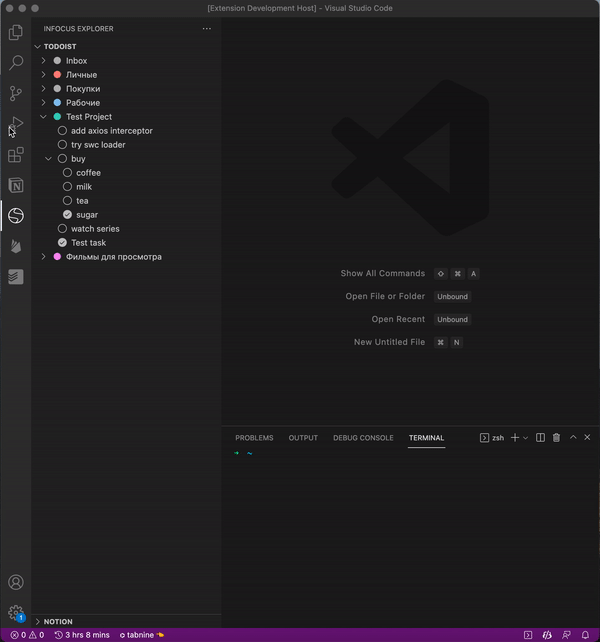

# vscode-infocus 

Roadmap:
### Todoist
- [x] get projects
- [x] get sections
- [x] get tasks
- [x] complete tasks
- [x] uncomplete tasks
- [x] open task in browser
- [] show completed tasks by config option
- [] full delete task
- [] (un)complete all subchild tasks
- [] inline edit task content
- [] inline edit section content
- [] inline edit project content
- [] support scheduler tasks
- [] add todos from code to todoist
- [] subscribe on events from backend
- [] offline work
- [] ...

<!-- ### Notion
### Google Keep
### Any\.do -->

## Configuration

> File > Preferences > Settings > InFocus

Setting id: `infocus.todoist.token` - token to access todoist

## Features

### Fast open extension tree from macos touchbar

