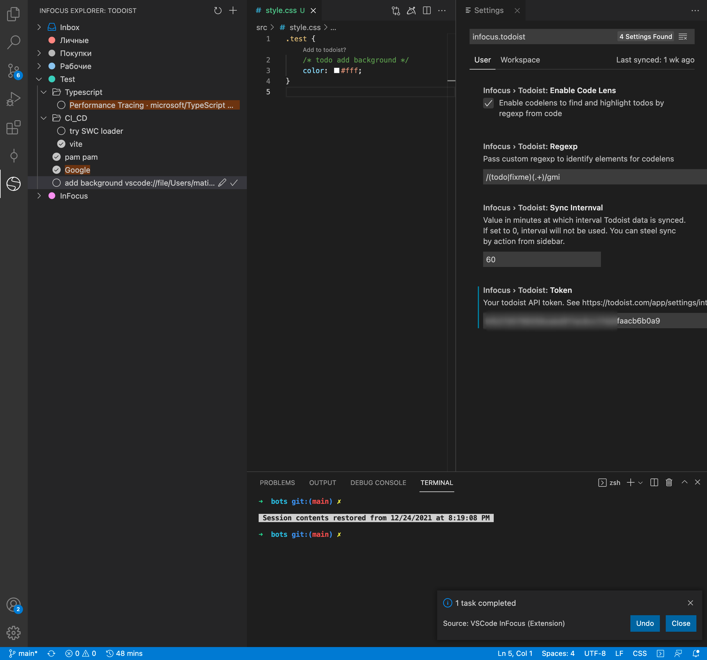
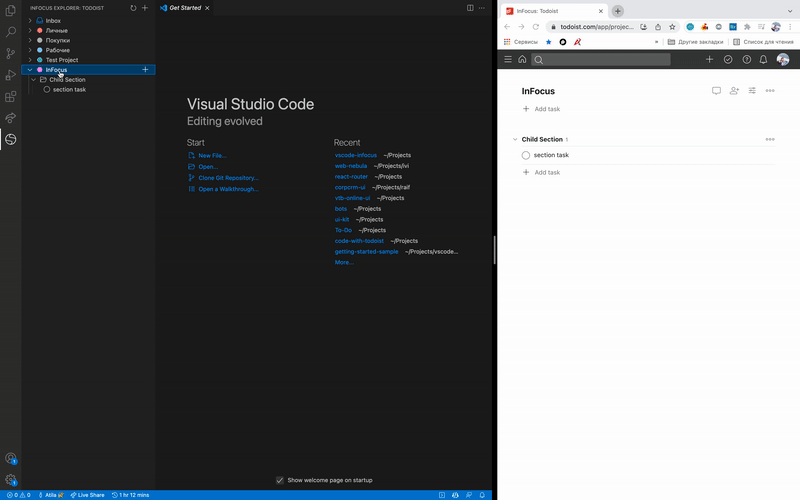
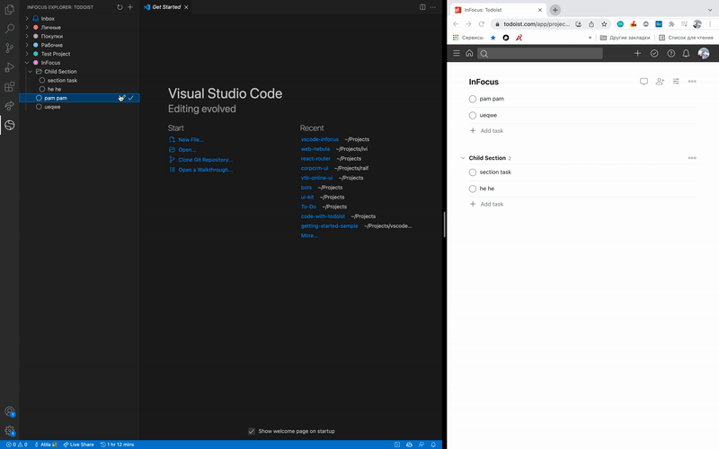
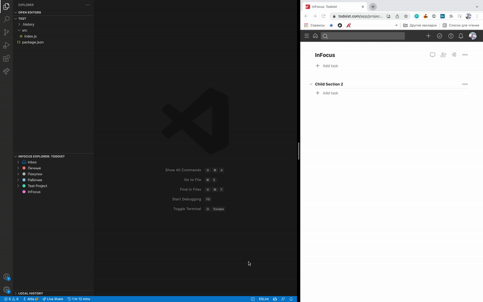
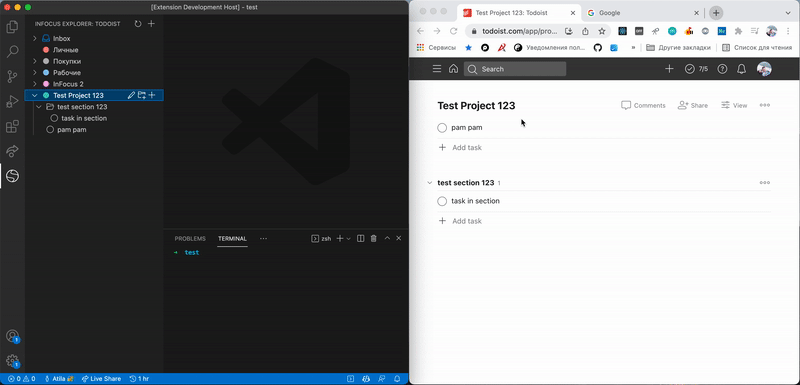

# vscode-infocus 

## Motivation
Make extension with customizable dashboard.
Todos, notes, snippets, etc. integrated into development flow.

## Available features

- Todoist integration in sidebar (tree view)
    - get projects, sections, tasks
    - complete, uncomplete tasks
    - open tasks in browser
    - create tasks and section in project or section
    - inline edit tasks, sections, projects name
    - notifications on due date of task (passed or came) 
    - show code lens for todos
    - toggle codelens mode
    - custom regex for codelens
    - highlighting links from tasks content and open them in browser
    - Today/Upcoming/Missed views
    - Copy to clipboard text content of task

## Preview

### Create tasks from toolbar, project or section

### Edit tasks content, (un)complete tasks

### Add tasks from code. Deep links from sidebar and web application

### Open links from task content using action icon

## Configuration
> File > Preferences > Settings > InFocus

Setting id: `infocus.todoist.token` - token to access todoist

Setting id: `infocus.todoist.syncInternval` - value in minutes at which interval Todoist data is synced. If set to 0, interval will not be used. You can steel sync by action from sidebar.

Setting id: `infocus.todoist.regexp` - regexp pattern to match todos from code with codelens
